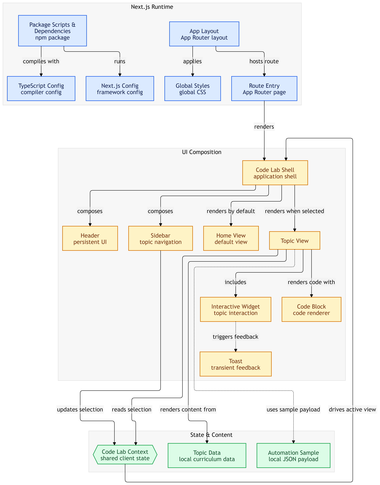

# 🧪 Next.js Code Lab

> An evolving, automated reference lab for learning and experimenting with modern Next.js patterns through practical examples.

Live demo: [here](https://next-js-automated-code-lab.vercel.app/)

---
**Next.js Code Lab** is a structured collection of Next.js concepts, implementation examples, architectural notes, and interactive demonstrations. Instead of being a static collection of tutorials, the project is designed to **continuously evolve through an automated daily workflow** that researches the Next.js ecosystem and adds meaningful examples when new topics are worth documenting.

The application provides a dashboard-style interface where each topic contains its explanation, best practices, use cases, and implementation examples.

---

## ✨ What Makes It Different?

Most learning repositories are manually updated and quickly become outdated.

This project experiments with a different approach:

```text
Research
   ↓
Discover relevant Next.js updates
   ↓
Select a meaningful topic
   ↓
Generate practical example
   ↓
Update documentation & code
   ↓
Validate the application
   ↓
Deploy
```

The automation is also capable of **skipping a run** when there is no sufficiently meaningful new topic instead of forcing unnecessary changes.

---

## 🚀 Features

* 📚 **Structured Next.js reference**

  * Concepts organized into focused categories
  * Practical implementation examples
  * Documentation, best practices, and use cases

* 💻 **Multi-file code examples**

  * Browse related files from a single example
  * Copy individual files directly to the clipboard

* 🔎 **Topic search**

  * Quickly find relevant topics from the sidebar

* 🔖 **Bookmarks**

  * Save topics for quick reference

* 📱 **Responsive interface**

  * Desktop sidebar navigation
  * Mobile navigation drawer

* 🧪 **Interactive examples**

  * Selected topics can include interactive demonstrations

* 🤖 **Daily automation**

  * Researches the latest Next.js developments
  * Determines whether a meaningful topic should be added
  * Generates or updates examples
  * Updates automation metadata
  * Validates the application before deployment

* 📊 **Automation dashboard**

  * Last automated run
  * Current automation status
  * Recent entry
  * Execution timeline
  * Topic statistics

---

## 🧠 Topics

The Code Lab currently organizes examples around areas such as:

| Category               | Focus                             |
| ---------------------- | --------------------------------- |
| App Router             | Routing and application structure |
| Server Components      | Server-side React patterns        |
| Server Actions         | Server-side mutations and forms   |
| Routing & Navigation   | Dynamic routes and navigation     |
| Data Fetching          | Fetching and consuming data       |
| Caching & Revalidation | Next.js caching patterns          |
| More                   | Continuously expanding            |

Each topic follows a structured data model containing its description, highlights, documentation, best practices, use cases, and associated code files.

---

## 🏗️ Architecture

The application is intentionally kept simple and self-contained.



The UI is composed around a `CodeLabApp`, with dedicated components for the sidebar, header, dashboard, topic view, code renderer, and toast notifications. Shared client state is handled through `CodeLabContext`.

### Design principle

The application intentionally remains a **pure client-side reference application** with its learning content embedded in TypeScript/JSON rather than depending on a database or server-side data layer.

---

## 🤖 Automated Daily Updates

One of the core ideas behind the project is that the repository itself can maintain its learning content.

The automation workflow:

1. 🔍 **Research & Discovery**

   * Search official Next.js releases, documentation, and ecosystem updates.

2. 🎯 **Topic Selection**

   * Determine whether a sufficiently useful new topic exists.

3. 💻 **Code Generation**

   * Create a realistic implementation example.

4. 📝 **Documentation**

   * Add explanations, highlights, best practices, and use cases.

5. 🧪 **Validation**

   * Run the application build to catch compilation and type errors.

6. 🚀 **Deployment**

   * Push/re-deploy the validated application.

The repository includes an explicit automation contract describing this process and its safety rules.

### No forced updates

An important part of the automation is **not changing the project just for the sake of changing it**.

If research doesn't reveal a meaningful new Next.js development, the automation can complete without modifying the application.

---

## 🗂️ Project Structure

```text
code-lab/
├── app/
│   ├── CodeLabApp.tsx
│   ├── globals.css
│   ├── layout.tsx
│   └── page.tsx
│
├── components/
│   ├── CodeBlock/
│   ├── Header/
│   ├── HomeView/
│   ├── Sidebar/
│   ├── Toast/
│   └── TopicView/
│
├── context/
│   └── CodeLabContext.tsx
│
├── data/
│   ├── automation-run.json
│   └── topicsData.ts
│
├── CODEX_GUIDE.md
├── AGENTS.md
├── CLAUDE.md
├── next.config.ts
├── package.json
└── tsconfig.json
```

The project separates UI, shared state, and learning content so automated updates can add or modify topics without restructuring the application.

---

## 🛠️ Tech Stack

* **Next.js 16**
* **React 19**
* **TypeScript**
* **Tailwind CSS**
* **CSS Modules**
* **Lucide React**
* **Next Font / Geist**

The current project configuration uses Next.js `16.3.0`, React `19.2.8`, TypeScript, Tailwind CSS, and Lucide React.

---

## ⚡ Getting Started

### 1. Clone the repository

```bash
git clone https://github.com/AbhilashTUofficial/NextJS-Automated-Code-lab.git

cd NextJS-Automated-Code-lab/code-lab
```

### 2. Install dependencies

```bash
npm install
```

### 3. Start the development server

```bash
npm run dev
```

Open:

```text
http://localhost:3000
```

### 4. Build for production

```bash
npm run build
```

### 5. Start production server

```bash
npm run start
```

---

## 🧩 Adding a Topic

Topics are primarily maintained through `data/topicsData.ts`.

A topic contains:

```text
Topic
├── Metadata
├── Description
├── Key Highlights
├── Documentation
│   ├── Overview
│   ├── Best Practices
│   └── Use Cases
├── Code Files
└── Optional Interactive Demo
```

This structure allows a single topic to provide both the **conceptual explanation** and the **implementation reference**.

---

## 🔐 Automation Safety Rules

The automated workflow follows several constraints:

* Never remove existing topics.
* Avoid breaking existing components.
* Keep the application self-contained.
* Use CSS Modules for new components.
* Validate changes with `npm run build`.
* Only introduce a new topic when it provides meaningful value.

These rules are documented in `CODEX_GUIDE.md` and are intended to make autonomous repository updates safer and predictable.

---

## 🎯 Project Goal

The long-term goal is simple:

> **Turn a Next.js repository into a continuously evolving personal reference lab.**

Instead of searching through scattered articles, bookmarks, and tutorials, the project aims to keep useful Next.js patterns, examples, and architectural knowledge in one place — while experimenting with **AI-assisted autonomous software maintenance**.

---

## 📌 Status

🚧 **Actively evolving**

New topics, examples, experiments, and improvements are added over time through the project's automated workflow.

---

## 👨‍💻 Author

**Abhilash TU**

Software Developer · Next.js · React · React Native · TypeScript

Built as a personal learning project and an experiment in **AI-powered continuous development**.

---

## ⭐ If You Find It Useful

If this project helps you understand Next.js or you find the autonomous development experiment interesting, consider giving the repository a ⭐.
